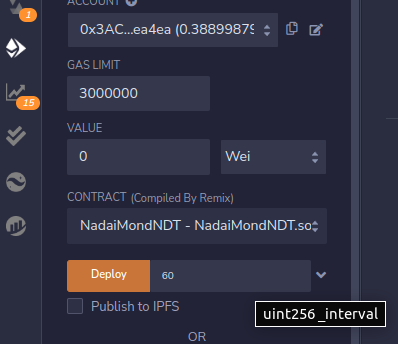

# Nadai Tutorial NFT Dinámicos con automatización de Chainlink

Puede encontrar los Workshop de [Chainlink Aquí](https://www.youtube.com/watch?v=1l6iuhn65HM) en formato `Video` y en documentos [Oficiales Chainlink](https://blog.chain.link/what-is-a-dynamic-nft/).

También puede revisar estos link de utilidad, alguno de ellos veremos más en profundidad:

* [Metadata Open Sea](https://docs.opensea.io/docs/metadata-standards)
* [Chainlink Keepers](https://automation.chain.link/) ahora se llama Chainlink Automation.

Para obtener más información, visite las Notas de la versión de [Chainlink Automation](https://docs.chain.link/docs/chainlink-automation/automation-release-notes/).
 
## Descripición General de los NadaiMon

Clone este repositorio

```bash
gh repo clone Nadai2010/Nadai-Chainlink-dNFT
cd Nadai-Chainlink-dNFT
```

Este repositorio contiene todos los archivos para poder replicar el workshop de principio a fin. Encotraremos un Smart Contract `NadaiMondNDT.sol` que contiene los ajustes necesarios para el lanzamiento de prueba de una colleción de 11 `NadaiMon`, estas criaturas son una especie de Pokemon que se alimenta de Token Link, así que necesitaremos añadir nuestro smart a [Chainlink Keepers](https://automation.chain.link/) el que se alimenta del faucet conseguido [aquí de Link](https://faucets.chain.link/).

## Preparación Wallet

Debera de tener una wallet con red de prueba añadida como `Goerli`. Puede seguir el link del  faucet [Link](https://faucets.chain.link/) para conseguir su goEth de pruebas y su Link (Registre con Twitter para conseguir 20 LINK).

## Configuración de archivos en Pinata

Aqui nos preparemos para subir las carpetas de imagenes que usaremos para nuestros NFT dinámicos, así que puede usar el Tutorial aquí descrito para dar vida a sus NadaiMon.

* También dispone de las `imagenes` y `Metadata` del workshop original de autos.
* También dispone de las `imagenes` y `Metadata` de un testeo de Supergirl.

Ahora que ya tenemos las imagenes las subiremos a un servicio de IPFS, teniendo nuestras imagenes y metadatos listas para nuestra creación de dNFT.

### Primer Paso

Accedemos a [Pinata](https://www.pinata.cloud/) nos registramos y hacemos login. Una vez dentro
de la app, (Sino lo les entra acceder desde [AQUI](https://app.pinata.cloud/)).


Seleccionamos la carpeta completa que queremos subir y se nos creara una carpeta con su CID.
Accedemos a ella y veremos que está todos nuestras imagenes, en las que tenemos que ir cogiendo su `CID` pero al meterlo en carpeta será el mismo y de una forma mas ordenada, vamos a las fotos y lo veremos mejor.


Como vemos nuestro CID aquí seran los mismos en nuestros NadaiMon cambiando el ultimo `/NadaiMon.png`, por `1`, `2`, así hasta completar las 11 de esta edición.
NOTA: Si se añaden sin carpeta quedarian todos con CID distintos.

-------


## Configuración Metadata

En este repositorio encontrará los Metadata que usaremos para nuestros NadaiMon. Los metadatos son datos que podran identificar en opensea sus atributos, nombre, valores y otros datos que queremos darle. En este Workshop haremos que los Metadatos que vayamos entregando sean de 10 imagenes en `png` de criaturas que iran cambiando su Potencia, Nombre, Tipo y otros atributos. Una última figura de todos juntos.

Puede consultar [Standar](https://docs.opensea.io/docs/metadata-standards) y modificar sus ajustes con cualquier editor. En nuestro caso usamos Vscode.

Si esta sigiendo el tutorial de NadaiMon puede ver una metadata base de la siguiente manera:


En estos 11 archivos hacen referencia a las imagenes que hemos subido antes a Pinata, por lo que deberemos remplazar en estos `.json` los `CID` que nos han dado. Asi que cambiaremos los 11 por otros que queramos añadir (PARA HACER EL DEPLOY PUEDE USAR SOLO EL SMART `NadaiMondNDT.sol`, SIN NINGUN CAMBIO), ya que aquí indicaremos un poco los ajustes realizados para entender su funcionamiento pero no profundarizaremos demasiado, cualquier duda final recuerde revisar [Workshop Chainlink](https://www.youtube.com/watch?v=1l6iuhn65HM).

-------


### Segundo Paso

Ahora procederemos a subir la carpeta de Metada que hemos modificado, o para este tutorial los ajustes de los NadaiMon estan en [Metadata NadaiMon](https://github.com/Nadai2010/Nadai-Chainlink-dNFT/tree/master/Metadata%20NadaiMon), una vez que entrenamos a los archivos `.json` veremos su nuevo `CID`, el que usaremos para nuestro `NadaiMondNDT.sol`


Ahora ya estamos listos para hacer el Deplo de nuestras criaturas Nadaimon.


## Deploy con Remix

A continuación le dejaremos una herramienta muy útil de OpenZeppelin para vuestras pruebas de Smart Contract. [Wizard](https://docs.openzeppelin.com/contracts/4.x/wizard)

Para realizar el `Compile` y `Deploy` lo realizaremos en este tutorial por [Remix](https://remix.ethereum.org/). Copiaremos el codigo de nuestro [NadaiMondNDT.sol](https://github.com/Nadai2010/Nadai-Chainlink-dNFT/blob/master/contracts/NadaiMondNDT.sol) que recomendamos que analize para entender su funcionamiento y lo añadirlo en REMIX.

* Le daremos a crear un archivo nuevo con el nombre del contrato.


* Luego realizamos el `Compile`.


* Luego procederemos a conectar nuestro Metamask en Goerli y conectarlo a Remix, para ello vamos a `Deploy Run Transactions` en `Environment` y cambiamos a `Injected Provider Metamask` como mostramos en la siguiente imagen.


* Y ahora ya estamos listos para darle vida a nuestras NadaiMon, para ello debemos indicar que intervalo de dinamismo vamos a darle a nuestras criaturas. Para este tutorial usamos `60` y sobre unos 15 min ya se habian actualizado todas las criaturas. Al darle `deploy` se abrirá nuestro metamask (Revisar que se encuentra en Goerli) y apruebe la transacción.



Aqui le adjuntamos el [Hash](https://goerli.etherscan.io/tx/0x8c6afc1e78cf4a1f79d6c086a54cfdf1fec6765a978314eb82c60f42b985aca2) de creación y el [Smart](https://goerli.etherscan.io/address/0x31b746230bd9df07c2dd84c08b17262c4424da8f) creado que puede Testear y Mint sus NadaiMon.

Para hacer `safeMint` o cualquier opción de leer o escribir en el `Smart` deberemos verificarlo


## Verify con Remix

En plugin de Remix buscaremos `ETHERSCAN - CONTRACT VERIFICATION`, y la instaleremos.


* Ahora necesitamos una API Key de [Etherscan](https://etherscan.io/myapikey), entramos nos registramos y añadimos una nueva que copiaremos para añadirla en remix.


* Dentro de Remix necesitamos añadir varios valores, revise [Hash](https://goerli.etherscan.io/tx/0x8c6afc1e78cf4a1f79d6c086a54cfdf1fec6765a978314eb82c60f42b985aca2) para este Workshop, o el `Deploy` del Smart que han realizado, para copiar los Argumentos del Constructor.


Una vez dado a `verify` ya debería poder leer el contrato, escribir en él y dar vida a nuestras criaturas. Pero primero tenemos que añadir la Automatización y dinamismo de Chainlink.


## Chainlink Automation

Ahora entraremos en [Chainlink Automation](https://docs.chain.link/docs/chainlink-automation/automation-release-notes/) para registrar nuestro Smart. Recuerde tener test de [Link](https://faucets.chain.link/) para su funcionamiento, necesitamos minimo 5 Link.

* Conectaremos la wallet y elegiremos la opción `Register New Upkeep`.


* Escogemos la opción `Custom Logic`, pegamos la dirección de nuestro `Smart` y se abrirá otra ventana en la que debemos de darle un nombre y ajustar el minimo de `5 link`


Una vez aprobemos la transacción ya tendriamos nuestro contrato con Keeper funcionando, y nuestras NadaiMon alimentandose de Link.

------

## Mint NadaiMon y visualizar en OpenSea

De nuevo entre en el [Smart](https://goerli.etherscan.io/address/0x31b746230bd9df07c2dd84c08b17262c4424da8f) o en el que haya desplegado en Remix.

* Conecte su wallet de Web3 Metamask, en el `safeMint` indique la wallet que desea crear sus dNFT. Una vez apruebe su Transacción su primer `NadaiMon` cobrará vida.


* Ahora ya estamos listo para revisar en su smart su `tokenid` y su `ipfs` que lanza.


Si todo ha ido bien ya esta listo pra ver sus imagenes en [Test Opensea](https://testnets.opensea.io/), conecte su `wallet` y revise que sea vean sus `NadaiMon`, iran cambiando durante el intervalo establecido aproximadamente cada minuto. Tambien podrá `refresh metadata` para actualizar sus Metadatos.


------------------

FELICIDADES¡¡¡¡ ya ha conseguido Crear NadaiMon con sus evoluciones, guardandos sus imagenes descentralizadamente y seguras.

** Podrá revisar [AQUI](https://testnets.opensea.io/assets/goerli/0x31b746230bd9df07c2dd84c08b17262c4424da8f/0) la Coleccion de Pruebas de Nadai. ** 
